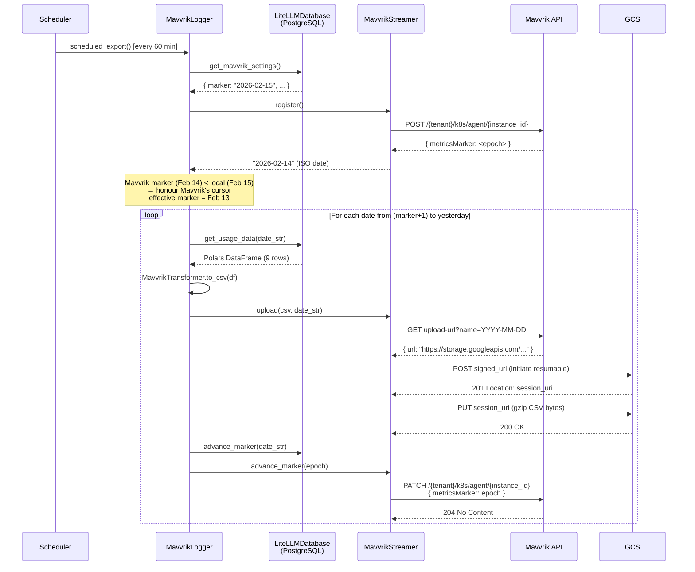

# Mavvrik Integration — Architecture Diagram

## Component Overview

```mermaid
graph TB
    subgraph LiteLLM_Proxy["LiteLLM Proxy (FastAPI)"]
        direction TB

        subgraph Admin_API["Admin API Layer"]
            EP1["POST /mavvrik/init"]
            EP2["GET  /mavvrik/settings"]
            EP3["PUT  /mavvrik/settings"]
            EP4["POST /mavvrik/dry-run"]
            EP5["POST /mavvrik/export"]
        end

        subgraph Core["Integration Core"]
            ML["MavvrikLogger\n(CustomLogger subclass)\nmavvrik.py"]
            DB["LiteLLMDatabase\ndatabase.py"]
            TX["MavvrikTransformer\ntransform.py"]
            ST["MavvrikStreamer\nmavvrik_stream_api.py"]
        end

        subgraph Scheduler["APScheduler (every 60 min)"]
            JOB["initialize_mavvrik_export_job()\n→ _scheduled_export()"]
        end

        subgraph PodLock["Pod Lock Manager (Redis)"]
            LOCK["Acquire / Release lock\n(prevents duplicate exports\nin multi-replica k8s)"]
        end
    end

    subgraph PostgreSQL["PostgreSQL Database"]
        DUS["LiteLLM_DailyUserSpend\n(one row per user/date/key/model/provider)\ndate column = TEXT YYYY-MM-DD"]
        CFG["LiteLLM_Config\nparam_name = mavvrik_settings\n{ api_key(encrypted), tenant,\n  instance_id, marker }"]
        VT["LiteLLM_VerificationToken\n(team_id, key_alias)"]
        TT["LiteLLM_TeamTable\n(team_alias)"]
        UT["LiteLLM_UserTable\n(user_email)"]
    end

    subgraph Mavvrik_API["Mavvrik API (api.mavvrik.dev)"]
        REG["POST /{tenant}/k8s/agent/{instance_id}\nRegister → metricsMarker epoch"]
        ADV["PATCH /{tenant}/k8s/agent/{instance_id}\nAdvance metricsMarker"]
        URL["GET /{tenant}/k8s/agent/{instance_id}/upload-url\n?name=YYYY-MM-DD → signed URL"]
    end

    subgraph GCS["Google Cloud Storage"]
        OBJ["{bucket}/{tenant}/k8s/{instance_id}/metrics/YYYY-MM-DD\ngzip-compressed CSV\n(overwrite = idempotent)"]
    end

    %% API call flow
    EP1 -->|"1. call register()"| ST
    ST -->|"POST register"| REG
    REG -->|"metricsMarker epoch"| ST
    EP1 -->|"2. encrypt + upsert"| CFG

    EP3 -->|"update marker / settings"| CFG

    EP4 -->|"query yesterday"| DB
    DB -->|"JOIN query"| DUS
    DB --- VT
    DB --- TT
    DB --- UT
    EP4 -->|"transform → CSV preview"| TX

    EP5 -->|"export_usage_data(date_str)"| ML

    %% Scheduler flow
    Scheduler -->|"every 60 min"| LOCK
    LOCK -->|"lock acquired"| JOB
    JOB -->|"1. read settings + marker"| CFG
    JOB -->|"2. register() — verify conn\n+ get metricsMarker"| ST
    ST -->|"POST register"| REG
    JOB -->|"3. loop: marker+1 → yesterday"| ML

    %% Per-date export
    ML -->|"get_usage_data(date_str)"| DB
    DB -->|"SELECT … WHERE date = $1"| DUS
    ML -->|"to_csv(df)"| TX
    TX -->|"CSV string"| ML
    ML -->|"upload(csv, date_str)"| ST

    %% GCS 3-step upload
    ST -->|"Step 1: get signed URL"| URL
    URL -->|"signed URL"| ST
    ST -->|"Step 2: POST initiate resumable"| OBJ
    ST -->|"Step 3: PUT gzip bytes"| OBJ

    %% Advance marker
    ML -->|"advance_marker(date_str)"| CFG
    ST -->|"PATCH metricsMarker epoch"| ADV

    %% LiteLLM API calls write to DB
    LiteLLM_API["LiteLLM API Calls\n(every completion)"]
    LiteLLM_API -->|"upsert every ~10-15s\naccumulates during day"| DUS
```



---

## Export Flow (Scheduled Run)



---

## Data Flow

```mermaid
flowchart LR
    subgraph Source["Source (LiteLLM DB)"]
        DUS["LiteLLM_DailyUserSpend\ndate = TEXT YYYY-MM-DD\nOne row per user/date/key/model/provider\nAggregated — not per-second"]
    end

    subgraph Transform["Transform"]
        Q["SQL JOIN query\n(VerificationToken, TeamTable, UserTable)"]
        PL["Polars DataFrame"]
        CSV["CSV string\n(header + rows)"]
        GZ["gzip bytes"]
    end

    subgraph Sink["Sink (GCS via Mavvrik)"]
        SIGN["Mavvrik signed URL\n?name=YYYY-MM-DD"]
        SESS["GCS resumable session URI"]
        OBJ["GCS object\n{bucket}/{tenant}/k8s/{instance_id}/metrics/YYYY-MM-DD\nOverwrite = idempotent"]
    end

    subgraph Cursor["Export Cursor"]
        MARK["marker in LiteLLM_Config\nYYYY-MM-DD\nAdvances one day at a time\nafter each successful upload"]
        MAVMARK["metricsMarker in Mavvrik\nepoch seconds\nPATCHed after each day\nRead on every run to detect resets"]
    end

    DUS -->|"SELECT WHERE date=$1"| Q
    Q --> PL
    PL -->|"to_csv()"| CSV
    CSV -->|"gzip compress"| GZ
    GZ -->|"GET upload-url"| SIGN
    SIGN -->|"POST initiate"| SESS
    SESS -->|"PUT bytes"| OBJ
    OBJ -->|"success"| MARK
    MARK --> MAVMARK
```



---

## File Structure

```
litellm/
├── integrations/mavvrik/
│   ├── mavvrik.py              # MavvrikLogger — scheduler entry-point, export loop
│   ├── database.py             # SQL queries against LiteLLM_DailyUserSpend + Config
│   ├── transform.py            # MavvrikTransformer — DataFrame → CSV string
│   └── mavvrik_stream_api.py   # MavvrikStreamer — register, upload, advance_marker
│
└── proxy/spend_tracking/
    └── mavvrik_endpoints.py    # FastAPI router — /mavvrik/init, settings, dry-run, export

litellm/types/proxy/
└── mavvrik_endpoints.py        # Pydantic request/response models

tests/test_litellm/integrations/mavvrik/
├── test_mavvrik_stream_api.py  # Unit tests (40) — mocked HTTP
├── test_transform.py           # Unit tests — CSV transformation
└── test_e2e_mavvrik_stream_api.py  # E2E tests (9) — real Mavvrik API + GCS

docs/
├── mavvrik-architecture.md     # This file
├── mavvrik-data-flow.md        # Data flow reference
└── mavvrik-onboarding.md       # User onboarding guide
```
